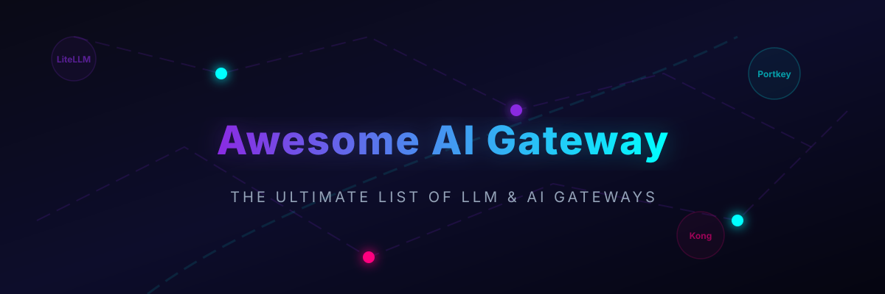

<!--
Title: Awesome AI Gateway & LLM Gateway Platforms
Description: A curated list of commercial and open-source AI and LLM gateway platforms featuring LiteLLM, Kong, Portkey, Cloudflare, Azure, and more. Optimized for cost, latency, and routing.
Keywords: ai gateway, llm gateway, llm proxy, litellm, portkey, kong, api gateway, machine learning, deep learning, artificial intelligence
-->

  

# Awesome-AI-Gateway-Platform

## 🚀 Similar Projects to AI Gateway / LLM Gateway Platforms

**AI Gateway (LLM Gateway)** platforms provide a unified API layer in front of multiple large language model providers. They handle routing, fallbacks, load balancing, virtual keys, budgets/cost tracking, rate limiting, caching, observability, guardrails, and often MCP/agent traffic. Leading commercial and managed tools include Portkey AI, OpenRouter, LiteLLM Gateway (managed options), Kong AI Gateway, Azure API Management, Tyk, MuleSoft, Gravitee, Zuplo, Cloudflare AI Gateway, Helicone, Braintrust Gateway, TrueFoundry AI Gateway, and NVIDIA Dynamo.

Below is a **curated list** ✨ of notable platforms and their open-source equivalents. The focus is on **open-source** solutions that can be self-hosted for full control over prompts, keys, and data.

## 🏢 SaaS / Hosted Platforms

| Platform | Description | Company Size (Valuation/Revenue) | Pricing & Free Tier Limits |
| --- | --- | --- | --- |
| **[Azure API Management / Azure AI Gateway](https://azure.microsoft.com/)** | Enterprise API management extended with AI policies, routing, and governance inside the Microsoft ecosystem. | ~$3.2 Trillion Valuation (Microsoft) | Free Developer tier (limited features); standard pay-as-you-go from $0.03 per 10k requests. |
| **[NVIDIA Dynamo](https://www.nvidia.com/)** | NVIDIA’s inference and AI serving/gateway-related technologies for high-performance deployments. | ~$3.1 Trillion Valuation (NVIDIA) | Pay-as-you-go pricing; free developer access via NVIDIA NIM API credits. |
| **[MuleSoft](https://www.mulesoft.com/)** | Enterprise integration platform with API and AI gateway features. | ~$250 Billion Valuation (Salesforce) | Custom Enterprise pricing (no public free tier; standard trial available). |
| **[Cloudflare AI Gateway](https://developers.cloudflare.com/ai-gateway/)** | Edge-based AI gateway with caching, analytics, rate limiting, and easy integration for Cloudflare users. | ~$30 Billion Valuation (Cloudflare) | Free tier available (up to 100k requests/day); paid plans are pay-as-you-go. |
| **[Kong AI Gateway](https://konghq.com/)** | AI-specific capabilities layered on Kong’s API gateway platform (open-source core + enterprise features). | ~$2.0 Billion Valuation (Kong Inc.) | Open source is free to self-host; custom enterprise pricing. |
| **[OpenRouter](https://openrouter.ai/)** | Popular managed multi-model gateway with access to hundreds of models through one API and pay-as-you-go credits. | ~$1.3 - $10 Billion Valuation | Free access to 10+ open models; pay-as-you-go based on token usage. |
| **[Braintrust Gateway](https://www.braintrust.dev/)** | Gateway and evaluation-focused tooling for LLM applications. | $800 Million Valuation | Free tier available (100 runs/mo, 5k trace events/mo); Team plan starts at $100/mo. |
| **[Gravitee / Gravitee AI Gateway](https://www.gravitee.io/)** | API management platform with AI gateway capabilities. | ~$150M - $250M Valuation ($125M Funding) | Free open-source self-hosting; custom enterprise contracts. |
| **[Portkey AI](https://portkey.ai/)** | Production AI gateway and control plane with strong governance, observability, guardrails, and prompt management (gateway core is open source). | ~$140 Million Valuation | Free Developer tier (10k requests/mo); Team plan starts at $99/mo. |
| **[Tyk](https://tyk.io/)** | API gateway with AI/LLM extensions and open-source options. | ~$100M+ Valuation ($41M Funding) | Free self-hosted developer tier (1 gateway); paid plans start at $150/mo. |
| **[TrueFoundry AI Gateway](https://www.truefoundry.com/)** | Enterprise AI gateway focused on self-hosted/VPC deployments, governance, and production LLMOps. | ~$50M - $100M Valuation ($21.3M Funding) | Custom enterprise pricing; free developer trial available. |
| **[Zuplo](https://zuplo.com/)** | Developer-friendly API gateway with AI/LLM support and serverless-style management. | ~$30M - $50M Valuation ($9M Funding) | Free tier available (up to 100k requests/mo); paid plans start at $25/mo. |
| **[Helicone](https://www.helicone.ai/)** | Observability-first AI gateway and LLMOps platform (strong open-source components available). | Acquired by Mintlify in 2026 | Free tier available (up to 10k requests/mo); paid plans start at $20/mo. |

## 🔓 Open-Source Software

### 🌟 Leading Open-Source LLM / AI Gateways
- **[LiteLLM](https://github.com/BerriAI/litellm)**  — The most widely adopted open-source LLM gateway and proxy (MIT). Provides an OpenAI-compatible API for 100+ providers, virtual keys, budgets, rate limits, fallbacks, load balancing, spend tracking, and an admin UI. Can be used as a Python SDK or self-hosted proxy.
- **[Kong AI Gateway](https://github.com/Kong/kong)**  — AI plugins and capabilities built on the mature open-source Kong API Gateway (Apache-2.0 core). Strong choice if you already run Kong for other APIs.
- **[Portkey Gateway](https://github.com/Portkey-AI/gateway)**  — Open-source AI gateway core (MIT/Apache) focused on production routing, retries, fallbacks, observability hooks, and governance features. Often paired with Portkey’s managed control plane.
- **[Helicone](https://github.com/Helicone/helicone)**  — Open-source LLM observability platform that also functions as an AI gateway. Excellent logging, tracing, sessions, caching, and analytics with self-hosting support.
- **[Bifrost](https://github.com/maximhq/bifrost)**  — High-performance open-source AI gateway written in Go. Emphasizes ultra-low latency, adaptive load balancing, virtual keys, budgets, guardrails, and support for many models/providers.

### 🛠️ Other Strong Open-Source Options
- **[new-api / one-api](https://github.com/QuantumNous/new-api)**  (and related forks) — Popular open-source relay/billing-focused gateways, especially active in multi-provider and team usage scenarios.
- **[Envoy AI Gateway / agentgateway](https://github.com/agentgateway/agentgateway)**  — Cloud-native, Envoy-based or dedicated gateways focused on LLM, MCP, and agent-to-agent (A2A) traffic with security and observability.
- **[Inference Gateway](https://github.com/inference-gateway)**  — Open-source, cloud-native gateway unifying multiple LLM providers (including local ones like Ollama) behind a single API with Kubernetes support.
- Various high-performance Go/Rust gateways (search GitHub for “llm-gateway”, “ai-gateway”, or “openai-proxy”) that prioritize low latency and simple deployment.

### 🌐 Typical Open-Source Stack Patterns
Many teams combine:
- **LiteLLM** or **Bifrost** as the core proxy/router
- **Helicone** (or built-in analytics) for observability
- Existing API gateways (Kong, Apache APISIX, Envoy) when they already manage broader traffic
- Self-hosted model servers (vLLM, Ollama, etc.) behind the gateway for hybrid cloud/local routing

---

🤝 **How to contribute**  
Fork this repository, add a new project (with link + short description + category), and open a pull request.  
Prefer actively maintained open-source projects that provide unified LLM routing, virtual keys, cost controls, or observability.

📄 **License**  
This list is public domain / CC0. Feel free to copy into your own awesome list or README.

Star the projects you find useful — the open-source AI gateway ecosystem is evolving very quickly! ⚡
